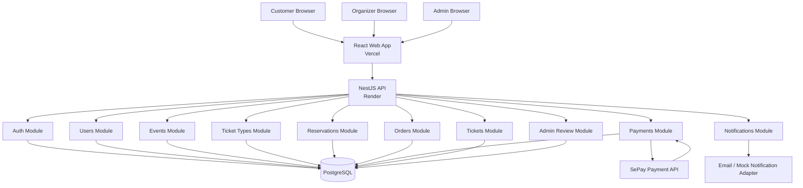
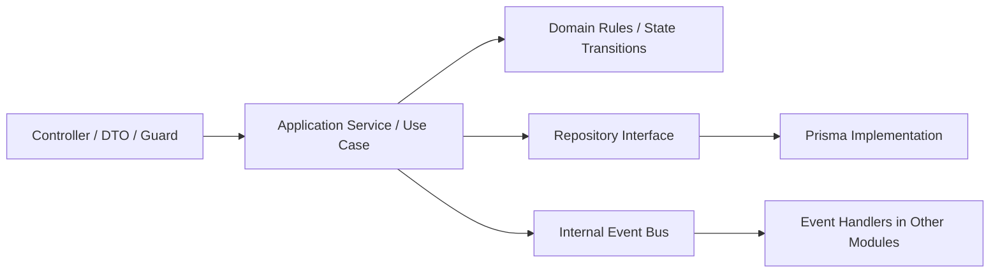
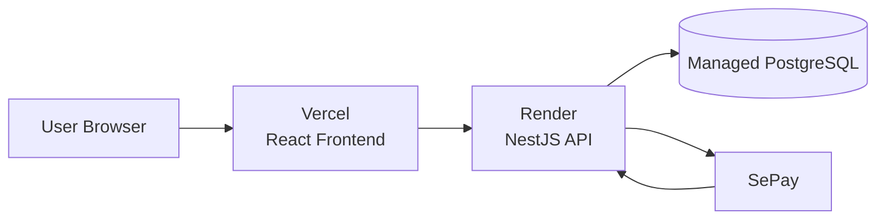

# izTicket Backend Architecture

Last updated: 2026-05-23

## 1. Context

`izTicket` is a web-based event ticketing system inspired by platforms such as Ticketbox and CTicket. The project is built as a software architecture course project, so the architecture must be clear enough to explain, practical enough to implement, and rich enough to discuss trade-offs.

The current repository provides a Turborepo foundation:

- `apps/api`: NestJS API, TypeScript, Prisma, PostgreSQL target.
- `apps/web`: React + Vite frontend.
- `apps/api/prisma`: database schema and future migrations.

The MVP supports three roles:

- `Customer`: browses public events, reserves tickets, pays through SePay, and receives e-tickets.
- `Organizer`: creates and manages events, ticket types, and views orders for their events.
- `Admin`: reviews organizer-submitted events before they become public.

## 2. Architecture Decision

The selected backend architecture is:

> Modular Monolith + Layered Architecture, enhanced by an Internal Event-Driven Pattern.

This means the system is deployed as one NestJS API application and one PostgreSQL database, but the source code and domain model are partitioned into clear business modules.

### Primary style: Modular Monolith

The backend is one deployable unit. Each business capability is implemented as a separate NestJS module with its own controllers, application services, domain rules, and data access boundary.

This fits the project because:

- The team size is 2-3 people.
- The MVP needs a fairly complete frontend and backend demo.
- A single API is easier to deploy on Render.
- A single database simplifies transactions for ticket inventory and payment state.
- Module boundaries can still be explained using coupling, cohesion, and modularity concepts.

### Supporting style: Layered Architecture

Each backend module follows layered responsibilities:

- `Presentation Layer`: controllers, request DTOs, response DTOs, guards, validation.
- `Application Layer`: use cases such as `CreateReservation`, `ApproveEvent`, `ConfirmPayment`.
- `Domain Layer`: business rules, state transitions, inventory rules, payment rules.
- `Infrastructure Layer`: Prisma repositories, SePay adapter, email/notification adapter.

### Supporting pattern: Internal Event-Driven Pattern

Domain events are used inside the same backend process for workflow coordination and side effects. This keeps modules less tightly coupled without requiring distributed infrastructure in the MVP.

Example events:

- `EventSubmitted`
- `EventApproved`
- `ReservationCreated`
- `ReservationExpired`
- `PaymentSucceeded`
- `PaymentFailed`
- `TicketIssued`

In the MVP, these events can be implemented in-process. When the system scales, the same event boundaries can be moved to a queue or message broker.

## 3. Architecture Diagram

## 4. Module Decomposition

| Module                 | Main responsibilities                                            | Owns data                                 | Emits or handles events                                                 |
| ---------------------- | ---------------------------------------------------------------- | ----------------------------------------- | ----------------------------------------------------------------------- |
| `Auth Module`          | Register, login, JWT issuing, password hashing, RBAC guards      | Credentials/auth-related user data        | Handles none initially                                                  |
| `Users Module`         | User profile, role management, organizer/customer/admin identity | Users, roles                              | Handles user lifecycle events if needed                                 |
| `Events Module`        | Event creation, editing, publishing status, event public listing | Events, venues, schedules                 | Emits `EventSubmitted`, handles `EventApproved`                         |
| `TicketTypes Module`   | Ticket categories, prices, sale windows, capacity per event      | Ticket types, inventory counters          | Handles event status changes if ticket sale rules depend on publication |
| `Reservations Module`  | Temporary ticket holds, expiration, inventory locking            | Reservations, reservation items           | Emits `ReservationCreated`, `ReservationExpired`                        |
| `Orders Module`        | Checkout orders, order item totals, order status                 | Orders, order items                       | Handles `PaymentSucceeded`, `PaymentFailed`, `ReservationExpired`       |
| `Payments Module`      | SePay payment request, webhook verification, payment status      | Payments, provider transaction references | Emits `PaymentSucceeded`, `PaymentFailed`                               |
| `Tickets Module`       | E-ticket issuing after successful payment                        | Tickets, ticket codes/QR payload          | Handles `PaymentSucceeded`, emits `TicketIssued`                        |
| `AdminReview Module`   | Admin approval/rejection workflow                                | Review decision records if needed         | Handles `EventSubmitted`, emits approval/rejection outcomes             |
| `Notifications Module` | Email or mock notifications for MVP                              | Notification logs if implemented          | Handles `TicketIssued`, `EventApproved`, `EventRejected`                |

## 5. Dependency Rules

To preserve modularity, each module should follow these rules:

- Controllers call application services in the same module.
- Application services coordinate domain rules and repositories.
- Domain rules should not depend on NestJS, Prisma, HTTP, or SePay SDK details.
- Infrastructure adapters implement external concerns such as Prisma and SePay.
- A module should not directly write another module's tables unless the operation is part of a coordinated transaction owned by an application use case.
- Cross-module side effects should prefer internal domain events.
- Public module APIs should be small and explicit.

Recommended dependency direction:

## 6. Core Domain Events

| Event                | Publisher             | Consumers                           | Purpose                                                            |
| -------------------- | --------------------- | ----------------------------------- | ------------------------------------------------------------------ |
| `EventSubmitted`     | `Events Module`       | `AdminReview`, `Notifications`      | Signals that an organizer has submitted an event for admin review. |
| `EventApproved`      | `AdminReview Module`  | `Events`, `Notifications`           | Publishes the event and notifies the organizer.                    |
| `EventRejected`      | `AdminReview Module`  | `Events`, `Notifications`           | Marks the event as rejected and sends rejection reason.            |
| `ReservationCreated` | `Reservations Module` | `Orders`, `Notifications` if needed | Starts the checkout window for a customer.                         |
| `ReservationExpired` | `Reservations Module` | `Orders`, `TicketTypes`             | Expires the order and releases held ticket inventory.              |
| `PaymentSucceeded`   | `Payments Module`     | `Orders`, `Reservations`, `Tickets` | Confirms payment and triggers ticket issuance.                     |
| `PaymentFailed`      | `Payments Module`     | `Orders`, `Reservations`            | Cancels or expires the checkout flow.                              |
| `TicketIssued`       | `Tickets Module`      | `Notifications`                     | Sends e-ticket information to the customer.                        |

## 7. Data Ownership

The MVP uses one PostgreSQL database. However, ownership is still defined at module level.

Suggested ownership:

- `Users Module`: `users`
- `Events Module`: `events`, `venues`, `event_schedules`
- `TicketTypes Module`: `ticket_types`
- `Reservations Module`: `reservations`, `reservation_items`
- `Orders Module`: `orders`, `order_items`
- `Payments Module`: `payments`, `payment_events`
- `Tickets Module`: `tickets`
- `AdminReview Module`: `event_reviews`
- `Notifications Module`: `notification_logs`

Foreign keys may connect modules, but business rules should still live in the owning module. For example, `orders.eventId` can reference an event, but the `Orders Module` should not decide whether an event can be published.

## 8. Data Consistency Strategy

Ticketing systems are sensitive to overselling, duplicate payment callbacks, and expired reservations. The consistency strategy is:

- Use strong consistency for ticket inventory, reservation creation, order state, and payment state.
- Use database transactions for reservation creation and payment confirmation.
- Use conditional updates for inventory, for example only decrement availability when `availableQuantity >= requestedQuantity`.
- Use idempotency for SePay webhook handling.
- Use eventual consistency for notifications and non-critical side effects.
- Model important workflow states explicitly instead of relying on boolean flags.

Important states:

- `Event`: `DRAFT`, `PENDING_REVIEW`, `PUBLISHED`, `REJECTED`, `CANCELLED`
- `Reservation`: `ACTIVE`, `CONFIRMED`, `EXPIRED`, `CANCELLED`
- `Order`: `PENDING_PAYMENT`, `PAID`, `EXPIRED`, `CANCELLED`, `PAYMENT_REVIEW`
- `Payment`: `INITIATED`, `SUCCEEDED`, `FAILED`, `REQUIRES_REVIEW`
- `Ticket`: `ISSUED`

## 9. Deployment View

The MVP deployment target is intentionally simple:

- React frontend: Vercel.
- NestJS API: Render web service.
- PostgreSQL: Render PostgreSQL or another managed PostgreSQL provider.
- SePay: external payment provider integration.

This deployment is best-effort for the course project. It does not require high availability. The most important reliability goal is correctness of the reservation, payment, and ticket issuing flow.

## 10. Non-Functional Requirements Mapping

| Characteristic  | MVP decision                                                           | Rationale                                                                                   |
| --------------- | ---------------------------------------------------------------------- | ------------------------------------------------------------------------------------------- |
| Scalability     | Modular monolith first, clear path to queues/services later            | Fits a few thousand users and a few hundred events while keeping implementation manageable. |
| Performance     | Indexed event listing, short checkout transactions, pagination         | Public event browsing and checkout should remain responsive.                                |
| Availability    | Best-effort deployment on Vercel/Render                                | Good enough for demo; avoids over-engineering HA infrastructure.                            |
| Security        | Email/password, hashed passwords, JWT, RBAC, webhook verification      | Covers role separation and payment callback safety.                                         |
| Maintainability | Domain modules, layered code, explicit state machines                  | Makes the code easier to divide across a 2-3 person team.                                   |
| Reliability     | Idempotent payment webhook, reservation expiry, transaction boundaries | Protects against overselling and duplicate payment callbacks.                               |

## 11. Scale Evolution

If the system grows beyond MVP, the architecture can evolve incrementally:

1. Keep the modular monolith, add background workers for reservation expiry and notifications.
2. Introduce Redis/BullMQ for asynchronous jobs.
3. Split read-heavy public event search into a cache or search index.
4. Extract `Payments` into a separate service if payment integration changes frequently.
5. Extract `Ticketing/Reservations` into a separate service if hot events create heavy inventory contention.
6. Move from internal events to a message broker such as RabbitMQ or Kafka if distributed services are introduced.

## 12. Main Architectural Risks

| Risk                                             | Impact        | Mitigation                                                                        |
| ------------------------------------------------ | ------------- | --------------------------------------------------------------------------------- |
| Overselling tickets during hot events            | High          | Use reservation holds, transaction boundaries, and conditional inventory updates. |
| Duplicate SePay webhook delivery                 | High          | Store provider transaction references and process webhook idempotently.           |
| Payment success arrives after reservation expiry | Medium        | Move order to `PAYMENT_REVIEW` instead of issuing tickets automatically.          |
| Modular monolith becomes tangled over time       | Medium        | Enforce module ownership and cross-module communication rules.                    |
| Frontend demo scope becomes too large            | Medium        | Prioritize complete happy paths for Customer, Organizer, and Admin.               |
| Render free-tier cold starts or downtime         | Low to medium | State as best-effort MVP limitation; keep demo data and local fallback ready.     |

## 13. Decision Log

| Decision                                            | Alternatives considered                                               | Reason                                                                                        |
| --------------------------------------------------- | --------------------------------------------------------------------- | --------------------------------------------------------------------------------------------- |
| Build MVP with Customer, Organizer, and Admin roles | Customer-only, Organizer-only                                         | Better demonstrates stakeholders, authorization, and real ticketing workflow.                 |
| Use Modular Monolith + Layered Architecture         | Service-based architecture, microservices, simple CRUD monolith       | Best balance of implementation feasibility and architecture discussion depth.                 |
| Add Internal Event-Driven Pattern                   | Direct service calls only, full distributed event-driven architecture | Reduces coupling without requiring distributed infrastructure.                                |
| Use SePay for payment integration                   | MoMo, ZaloPay, Stripe, mock payment                                   | Local payment context and richer integration story than mock payment.                         |
| Use reservation hold for inventory                  | Decrement only after payment, decrement permanently at order creation | Prevents overselling and avoids permanently locking unpaid tickets.                           |
| Deploy frontend on Vercel and API on Render         | Local-only demo, full cloud/Kubernetes                                | Practical deployment that can earn basic deployment credibility without excessive complexity. |
