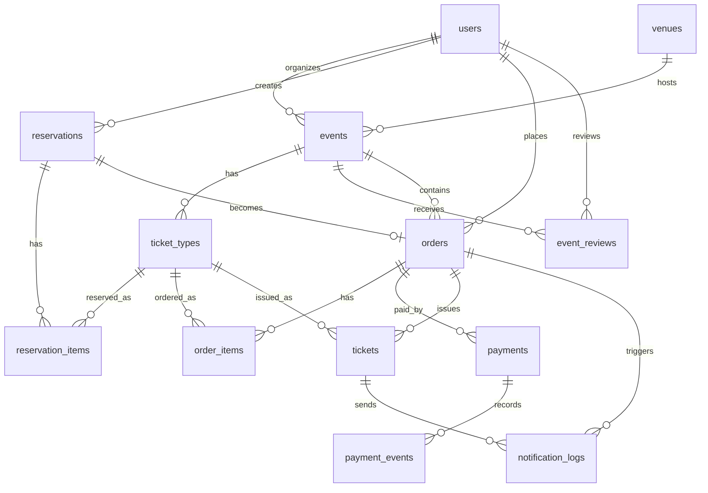

# izTicket Database Design

Last updated: 2026-05-23

## 1. Purpose

This document defines the database design for the `izTicket` MVP. The design supports:

- Customer, Organizer, and Admin roles.
- Event creation and admin approval.
- Public event browsing.
- Ticket type and inventory management.
- Reservation hold for 10-15 minutes.
- Order and SePay payment tracking.
- Idempotent payment webhook handling.
- E-ticket issuing after successful payment.

The target database is PostgreSQL, accessed through Prisma in the NestJS API.

## 2. Design Principles

- Use UUID primary keys for all main entities.
- Keep one PostgreSQL database for the modular monolith MVP.
- Define table ownership by backend module.
- Store money as integer VND amounts, not floating-point values.
- Use explicit status fields for state machines.
- Use database constraints and indexes to protect important business rules.
- Keep payment webhook processing idempotent.
- Keep ticket inventory changes inside database transactions.

## 3. Entity Relationship Overview



## 4. Modules and Table Ownership

| Backend module         | Owned tables                        |
| ---------------------- | ----------------------------------- |
| `User Module`          | `users`                             |
| `Events Module`        | `events`, `venues`                  |
| `TicketTypes Module`   | `ticket_types`                      |
| `AdminReview Module`   | `event_reviews`                     |
| `Reservations Module`  | `reservations`, `reservation_items` |
| `Orders Module`        | `orders`, `order_items`             |
| `Payments Module`      | `payments`, `payment_events`        |
| `Tickets Module`       | `tickets`                           |
| `Notifications Module` | `notification_logs`                 |

Foreign keys can cross module boundaries, but each module owns the rules that change its tables.

## 5. Enum Definitions

### `UserRole`

| Value       | Meaning                                                |
| ----------- | ------------------------------------------------------ |
| `CUSTOMER`  | Can browse, reserve, order, pay, and view own tickets. |
| `ORGANIZER` | Can create and manage own events.                      |
| `ADMIN`     | Can approve or reject submitted events.                |

### `UserStatus`

| Value      | Meaning                              |
| ---------- | ------------------------------------ |
| `ACTIVE`   | User can sign in and use the system. |
| `DISABLED` | User is blocked from signing in.     |

### `EventStatus`

| Value            | Meaning                               |
| ---------------- | ------------------------------------- |
| `DRAFT`          | Organizer is editing the event.       |
| `PENDING_REVIEW` | Event is waiting for admin approval.  |
| `PUBLISHED`      | Event is public and can sell tickets. |
| `REJECTED`       | Admin rejected the event.             |
| `CANCELLED`      | Event is no longer active.            |

### `ReservationStatus`

| Value       | Meaning                                  |
| ----------- | ---------------------------------------- |
| `ACTIVE`    | Tickets are temporarily held.            |
| `CONFIRMED` | Payment succeeded before expiry.         |
| `EXPIRED`   | Hold expired and inventory was released. |
| `CANCELLED` | Customer or system cancelled the hold.   |

### `OrderStatus`

| Value             | Meaning                                                |
| ----------------- | ------------------------------------------------------ |
| `PENDING_PAYMENT` | Order is waiting for payment.                          |
| `PAID`            | Payment succeeded and tickets can be issued.           |
| `EXPIRED`         | Reservation expired before payment.                    |
| `CANCELLED`       | Order was cancelled or payment failed.                 |
| `PAYMENT_REVIEW`  | Payment succeeded but order state needs manual review. |

### `PaymentStatus`

| Value             | Meaning                             |
| ----------------- | ----------------------------------- |
| `INITIATED`       | Payment request was created.        |
| `SUCCEEDED`       | Provider confirmed payment success. |
| `FAILED`          | Provider reported failure.          |
| `REQUIRES_REVIEW` | Callback is inconsistent or late.   |

### `TicketStatus`

| Value    | Meaning                                           |
| -------- | ------------------------------------------------- |
| `ISSUED` | Ticket has been issued to a customer.             |
| `VOIDED` | Ticket is invalidated due to cancellation/refund. |

### `NotificationStatus`

| Value     | Meaning                                       |
| --------- | --------------------------------------------- |
| `PENDING` | Notification has not been processed yet.      |
| `SENT`    | Notification was sent or logged successfully. |
| `FAILED`  | Notification failed.                          |

## 6. Table Design

### `users`

Owned by: `User Module`

Stores all authenticated users.

| Column          | Type           | Required | Notes                                      |
| --------------- | -------------- | -------- | ------------------------------------------ |
| `id`            | `uuid`         | Yes      | Primary key.                               |
| `email`         | `varchar(255)` | Yes      | Unique, case-normalized.                   |
| `password_hash` | `text`         | Yes      | Hashed password, never store raw password. |
| `name`          | `varchar(120)` | Yes      | Display name.                              |
| `role`          | `UserRole`     | Yes      | `CUSTOMER`, `ORGANIZER`, or `ADMIN`.       |
| `status`        | `UserStatus`   | Yes      | Default `ACTIVE`.                          |
| `created_at`    | `timestamp`    | Yes      | Creation timestamp.                        |
| `updated_at`    | `timestamp`    | Yes      | Last update timestamp.                     |

Indexes and constraints:

- Unique index on `email`.
- Index on `role`.
- Index on `status`.

### `venues`

Owned by: `Events Module`

Stores event location information.

| Column       | Type           | Required | Notes                         |
| ------------ | -------------- | -------- | ----------------------------- |
| `id`         | `uuid`         | Yes      | Primary key.                  |
| `name`       | `varchar(160)` | Yes      | Venue name.                   |
| `address`    | `text`         | Yes      | Full address.                 |
| `city`       | `varchar(100)` | Yes      | Used for event search/filter. |
| `district`   | `varchar(100)` | No       | Optional finer location.      |
| `map_url`    | `text`         | No       | Optional map link.            |
| `created_at` | `timestamp`    | Yes      | Creation timestamp.           |
| `updated_at` | `timestamp`    | Yes      | Last update timestamp.        |

Indexes:

- Index on `city`.

### `events`

Owned by: `Events Module`

Stores organizer-created events.

| Column          | Type           | Required | Notes                                       |
| --------------- | -------------- | -------- | ------------------------------------------- |
| `id`            | `uuid`         | Yes      | Primary key.                                |
| `organizer_id`  | `uuid`         | Yes      | FK to `users.id`; user must be `ORGANIZER`. |
| `venue_id`      | `uuid`         | Yes      | FK to `venues.id`.                          |
| `title`         | `varchar(180)` | Yes      | Event title.                                |
| `slug`          | `varchar(220)` | Yes      | Public URL slug.                            |
| `description`   | `text`         | Yes      | Event description.                          |
| `category`      | `varchar(80)`  | Yes      | Example: concert, workshop, conference.     |
| `status`        | `EventStatus`  | Yes      | Default `DRAFT`.                            |
| `thumbnail_url` | `text`         | No       | Event cover image.                          |
| `starts_at`     | `timestamp`    | Yes      | Start time.                                 |
| `ends_at`       | `timestamp`    | Yes      | End time.                                   |
| `submitted_at`  | `timestamp`    | No       | When organizer submits for review.          |
| `published_at`  | `timestamp`    | No       | When admin approves.                        |
| `cancelled_at`  | `timestamp`    | No       | When event is cancelled.                    |
| `created_at`    | `timestamp`    | Yes      | Creation timestamp.                         |
| `updated_at`    | `timestamp`    | Yes      | Last update timestamp.                      |

Indexes and constraints:

- Unique index on `slug`.
- Index on `organizer_id`.
- Index on `status`.
- Index on `category`.
- Index on `starts_at`.
- Composite index on `(status, starts_at)`.
- Constraint: `ends_at > starts_at`.

### `event_reviews`

Owned by: `AdminReview Module`

Stores admin decisions for event approval.

| Column        | Type          | Required | Notes                                   |
| ------------- | ------------- | -------- | --------------------------------------- |
| `id`          | `uuid`        | Yes      | Primary key.                            |
| `event_id`    | `uuid`        | Yes      | FK to `events.id`.                      |
| `reviewer_id` | `uuid`        | Yes      | FK to `users.id`; user must be `ADMIN`. |
| `decision`    | `varchar(20)` | Yes      | `APPROVED` or `REJECTED`.               |
| `reason`      | `text`        | No       | Required for rejection.                 |
| `created_at`  | `timestamp`   | Yes      | Review timestamp.                       |

Indexes:

- Index on `event_id`.
- Index on `reviewer_id`.
- Index on `created_at`.

### `ticket_types`

Owned by: `TicketTypes Module`

Stores sellable ticket categories for an event.

| Column               | Type           | Required | Notes                                       |
| -------------------- | -------------- | -------- | ------------------------------------------- |
| `id`                 | `uuid`         | Yes      | Primary key.                                |
| `event_id`           | `uuid`         | Yes      | FK to `events.id`.                          |
| `name`               | `varchar(120)` | Yes      | Example: Standard, VIP.                     |
| `description`        | `text`         | No       | Ticket details.                             |
| `price_vnd`          | `integer`      | Yes      | Store VND amount as integer.                |
| `total_quantity`     | `integer`      | Yes      | Total ticket capacity for this type.        |
| `available_quantity` | `integer`      | Yes      | Current quantity available for reservation. |
| `sold_quantity`      | `integer`      | Yes      | Confirmed sold quantity. Default `0`.       |
| `max_per_order`      | `integer`      | No       | Optional purchase limit per order.          |
| `sale_starts_at`     | `timestamp`    | Yes      | Sale opening time.                          |
| `sale_ends_at`       | `timestamp`    | Yes      | Sale closing time.                          |
| `created_at`         | `timestamp`    | Yes      | Creation timestamp.                         |
| `updated_at`         | `timestamp`    | Yes      | Last update timestamp.                      |

Indexes and constraints:

- Index on `event_id`.
- Composite index on `(event_id, sale_starts_at, sale_ends_at)`.
- Constraint: `price_vnd >= 0`.
- Constraint: `total_quantity >= 0`.
- Constraint: `available_quantity >= 0`.
- Constraint: `sold_quantity >= 0`.
- Constraint: `available_quantity + sold_quantity <= total_quantity`.
- Constraint: `sale_ends_at > sale_starts_at`.

Note: `available_quantity` is decremented when a reservation is created. If the reservation expires or is cancelled, the quantity is incremented back. When payment succeeds, `sold_quantity` is incremented and the reservation becomes confirmed.

### `reservations`

Owned by: `Reservations Module`

Stores temporary ticket holds.

| Column         | Type                | Required | Notes                                      |
| -------------- | ------------------- | -------- | ------------------------------------------ |
| `id`           | `uuid`              | Yes      | Primary key.                               |
| `customer_id`  | `uuid`              | Yes      | FK to `users.id`; user must be `CUSTOMER`. |
| `event_id`     | `uuid`              | Yes      | FK to `events.id`.                         |
| `status`       | `ReservationStatus` | Yes      | Default `ACTIVE`.                          |
| `expires_at`   | `timestamp`         | Yes      | Hold expiry time.                          |
| `confirmed_at` | `timestamp`         | No       | Set after successful payment.              |
| `cancelled_at` | `timestamp`         | No       | Set when cancelled.                        |
| `created_at`   | `timestamp`         | Yes      | Creation timestamp.                        |
| `updated_at`   | `timestamp`         | Yes      | Last update timestamp.                     |

Indexes:

- Index on `customer_id`.
- Index on `event_id`.
- Composite index on `(status, expires_at)` for expiry job.

### `reservation_items`

Owned by: `Reservations Module`

Stores ticket quantities held in a reservation.

| Column           | Type        | Required | Notes                               |
| ---------------- | ----------- | -------- | ----------------------------------- |
| `id`             | `uuid`      | Yes      | Primary key.                        |
| `reservation_id` | `uuid`      | Yes      | FK to `reservations.id`.            |
| `ticket_type_id` | `uuid`      | Yes      | FK to `ticket_types.id`.            |
| `quantity`       | `integer`   | Yes      | Reserved quantity.                  |
| `unit_price_vnd` | `integer`   | Yes      | Price snapshot at reservation time. |
| `subtotal_vnd`   | `integer`   | Yes      | `quantity * unit_price_vnd`.        |
| `created_at`     | `timestamp` | Yes      | Creation timestamp.                 |

Indexes and constraints:

- Index on `reservation_id`.
- Index on `ticket_type_id`.
- Unique index on `(reservation_id, ticket_type_id)`.
- Constraint: `quantity > 0`.
- Constraint: `unit_price_vnd >= 0`.
- Constraint: `subtotal_vnd >= 0`.

### `orders`

Owned by: `Orders Module`

Stores customer checkout orders.

| Column             | Type          | Required | Notes                               |
| ------------------ | ------------- | -------- | ----------------------------------- |
| `id`               | `uuid`        | Yes      | Primary key.                        |
| `customer_id`      | `uuid`        | Yes      | FK to `users.id`.                   |
| `event_id`         | `uuid`        | Yes      | FK to `events.id`.                  |
| `reservation_id`   | `uuid`        | Yes      | FK to `reservations.id`.            |
| `status`           | `OrderStatus` | Yes      | Default `PENDING_PAYMENT`.          |
| `total_amount_vnd` | `integer`     | Yes      | Server-calculated total.            |
| `expires_at`       | `timestamp`   | Yes      | Usually same as reservation expiry. |
| `paid_at`          | `timestamp`   | No       | Set after payment success.          |
| `cancelled_at`     | `timestamp`   | No       | Set when cancelled.                 |
| `created_at`       | `timestamp`   | Yes      | Creation timestamp.                 |
| `updated_at`       | `timestamp`   | Yes      | Last update timestamp.              |

Indexes and constraints:

- Unique index on `reservation_id` to ensure one order per reservation.
- Index on `customer_id`.
- Index on `event_id`.
- Index on `status`.
- Composite index on `(status, expires_at)`.
- Constraint: `total_amount_vnd >= 0`.

### `order_items`

Owned by: `Orders Module`

Stores final order line items, copied from reservation items.

| Column           | Type        | Required | Notes                        |
| ---------------- | ----------- | -------- | ---------------------------- |
| `id`             | `uuid`      | Yes      | Primary key.                 |
| `order_id`       | `uuid`      | Yes      | FK to `orders.id`.           |
| `ticket_type_id` | `uuid`      | Yes      | FK to `ticket_types.id`.     |
| `quantity`       | `integer`   | Yes      | Ordered quantity.            |
| `unit_price_vnd` | `integer`   | Yes      | Price snapshot.              |
| `subtotal_vnd`   | `integer`   | Yes      | `quantity * unit_price_vnd`. |
| `created_at`     | `timestamp` | Yes      | Creation timestamp.          |

Indexes and constraints:

- Index on `order_id`.
- Index on `ticket_type_id`.
- Unique index on `(order_id, ticket_type_id)`.
- Constraint: `quantity > 0`.
- Constraint: `unit_price_vnd >= 0`.
- Constraint: `subtotal_vnd >= 0`.

### `payments`

Owned by: `Payments Module`

Stores payment attempts for orders.

| Column                    | Type            | Required | Notes                                                   |
| ------------------------- | --------------- | -------- | ------------------------------------------------------- |
| `id`                      | `uuid`          | Yes      | Primary key.                                            |
| `order_id`                | `uuid`          | Yes      | FK to `orders.id`.                                      |
| `provider`                | `varchar(40)`   | Yes      | Default `SEPAY`.                                        |
| `provider_transaction_id` | `varchar(160)`  | No       | Provider transaction/reference id.                      |
| `provider_reference`      | `varchar(160)`  | No       | Internal or provider reference used for reconciliation. |
| `status`                  | `PaymentStatus` | Yes      | Default `INITIATED`.                                    |
| `amount_vnd`              | `integer`       | Yes      | Payment amount.                                         |
| `payment_url`             | `text`          | No       | Provider payment URL or QR URL if available.            |
| `raw_provider_payload`    | `jsonb`         | No       | Last provider payload snapshot.                         |
| `succeeded_at`            | `timestamp`     | No       | Set after success webhook.                              |
| `failed_at`               | `timestamp`     | No       | Set after failure webhook.                              |
| `created_at`              | `timestamp`     | Yes      | Creation timestamp.                                     |
| `updated_at`              | `timestamp`     | Yes      | Last update timestamp.                                  |

Indexes and constraints:

- Index on `order_id`.
- Index on `status`.
- Unique index on `(provider, provider_transaction_id)` where `provider_transaction_id` is not null.
- Unique index on `(provider, provider_reference)` where `provider_reference` is not null.
- Constraint: `amount_vnd >= 0`.

### `payment_events`

Owned by: `Payments Module`

Stores webhook/event delivery records for idempotency and audit.

| Column                    | Type           | Required | Notes                                        |
| ------------------------- | -------------- | -------- | -------------------------------------------- |
| `id`                      | `uuid`         | Yes      | Primary key.                                 |
| `payment_id`              | `uuid`         | No       | FK to `payments.id`, nullable until matched. |
| `provider`                | `varchar(40)`  | Yes      | Example: `SEPAY`.                            |
| `provider_event_id`       | `varchar(180)` | No       | Unique id from provider if available.        |
| `provider_transaction_id` | `varchar(160)` | No       | Transaction/reference from webhook.          |
| `event_type`              | `varchar(80)`  | Yes      | Example: `payment.succeeded`.                |
| `payload`                 | `jsonb`        | Yes      | Raw webhook payload.                         |
| `processed_at`            | `timestamp`    | No       | Set after successful processing.             |
| `created_at`              | `timestamp`    | Yes      | Receive timestamp.                           |

Indexes and constraints:

- Index on `payment_id`.
- Index on `provider_transaction_id`.
- Unique index on `(provider, provider_event_id)` where `provider_event_id` is not null.

### `tickets`

Owned by: `Tickets Module`

Stores issued e-tickets.

| Column           | Type           | Required | Notes                          |
| ---------------- | -------------- | -------- | ------------------------------ |
| `id`             | `uuid`         | Yes      | Primary key.                   |
| `order_id`       | `uuid`         | Yes      | FK to `orders.id`.             |
| `order_item_id`  | `uuid`         | Yes      | FK to `order_items.id`.        |
| `ticket_type_id` | `uuid`         | Yes      | FK to `ticket_types.id`.       |
| `customer_id`    | `uuid`         | Yes      | FK to `users.id`.              |
| `event_id`       | `uuid`         | Yes      | FK to `events.id`.             |
| `ticket_code`    | `varchar(80)`  | Yes      | Unique public ticket code.     |
| `qr_payload`     | `text`         | Yes      | Signed payload for QR display. |
| `status`         | `TicketStatus` | Yes      | Default `ISSUED`.              |
| `issued_at`      | `timestamp`    | Yes      | Ticket issue time.             |
| `voided_at`      | `timestamp`    | No       | Set if ticket is invalidated.  |
| `created_at`     | `timestamp`    | Yes      | Creation timestamp.            |

Indexes and constraints:

- Unique index on `ticket_code`.
- Index on `order_id`.
- Index on `customer_id`.
- Index on `event_id`.
- Index on `ticket_type_id`.
- Composite index on `(customer_id, event_id)`.

### `notification_logs`

Owned by: `Notifications Module`

Stores notification attempts. For MVP, this can be used even if real email sending is not implemented yet.

| Column       | Type                 | Required | Notes                                       |
| ------------ | -------------------- | -------- | ------------------------------------------- |
| `id`         | `uuid`               | Yes      | Primary key.                                |
| `user_id`    | `uuid`               | No       | FK to `users.id`.                           |
| `order_id`   | `uuid`               | No       | FK to `orders.id`.                          |
| `ticket_id`  | `uuid`               | No       | FK to `tickets.id`.                         |
| `type`       | `varchar(80)`        | Yes      | Example: `TICKET_ISSUED`, `EVENT_APPROVED`. |
| `channel`    | `varchar(40)`        | Yes      | Example: `EMAIL`, `IN_APP`, `LOG`.          |
| `status`     | `NotificationStatus` | Yes      | Default `PENDING`.                          |
| `recipient`  | `varchar(255)`       | No       | Email address or target.                    |
| `payload`    | `jsonb`              | No       | Render data.                                |
| `sent_at`    | `timestamp`          | No       | Set when sent.                              |
| `created_at` | `timestamp`          | Yes      | Creation timestamp.                         |
| `updated_at` | `timestamp`          | Yes      | Last update timestamp.                      |

Indexes:

- Index on `user_id`.
- Index on `order_id`.
- Index on `ticket_id`.
- Index on `status`.
- Index on `type`.

## 7. Critical Transaction Designs

### 7.1 Create reservation

Purpose: hold ticket inventory safely.

Transaction steps:

1. Load event and ticket types.
2. Verify event is `PUBLISHED`.
3. Verify ticket sale window is active.
4. For each requested ticket type, conditionally decrement `available_quantity`.
5. Insert `reservations` row with `ACTIVE` status and `expires_at`.
6. Insert `reservation_items`.
7. Commit.

Important SQL shape:

```sql
UPDATE ticket_types
SET available_quantity = available_quantity - :quantity
WHERE id = :ticket_type_id
  AND available_quantity >= :quantity;
```

If the affected row count is `0`, the system must abort the transaction.

### 7.2 Expire reservation

Purpose: return unpaid tickets to the available pool.

Transaction steps:

1. Find `ACTIVE` reservations where `expires_at < now()`.
2. Mark reservation as `EXPIRED`.
3. Mark related order as `EXPIRED` if it is still `PENDING_PAYMENT`.
4. Increment `available_quantity` for each reservation item.
5. Commit.

The update must only affect reservations that are still `ACTIVE`.

### 7.3 Confirm payment

Purpose: convert a paid order into issued tickets.

Transaction steps:

1. Store raw webhook payload in `payment_events`.
2. Verify the webhook has not already been processed.
3. Find matching payment/order/reservation.
4. If reservation is still `ACTIVE`, mark payment `SUCCEEDED`, order `PAID`, reservation `CONFIRMED`.
5. Increment `sold_quantity` on related ticket types.
6. Commit the payment/order/reservation state.
7. Publish internal `PaymentSucceeded` event.
8. Ticket handler creates `tickets` idempotently.

If reservation is already `EXPIRED`, mark order as `PAYMENT_REVIEW` and do not issue tickets automatically.

## 8. Recommended Index Summary

| Table            | Index                                        | Purpose                                      |
| ---------------- | -------------------------------------------- | -------------------------------------------- |
| `users`          | `email` unique                               | Login lookup and duplicate prevention.       |
| `events`         | `(status, starts_at)`                        | Public listing of upcoming published events. |
| `events`         | `organizer_id`                               | Organizer dashboard.                         |
| `events`         | `slug` unique                                | Public event URL lookup.                     |
| `ticket_types`   | `event_id`                                   | Event detail and ticket listing.             |
| `reservations`   | `(status, expires_at)`                       | Expiry job.                                  |
| `orders`         | `reservation_id` unique                      | One order per reservation.                   |
| `orders`         | `(status, expires_at)`                       | Expiry and operational queries.              |
| `payments`       | `(provider, provider_transaction_id)` unique | Payment idempotency.                         |
| `payment_events` | `(provider, provider_event_id)` unique       | Webhook idempotency.                         |
| `tickets`        | `ticket_code` unique                         | Ticket verification.                         |
| `tickets`        | `(customer_id, event_id)`                    | Customer ticket list.                        |

## 9. Data Lifecycle

### Event data

Events are created by organizers and remain in the database even if rejected or cancelled. This preserves audit history for the report and future admin support use cases.

### Reservation data

Reservations are not deleted after expiry. Expired reservations are useful for debugging, analytics, and demonstrating checkout behavior.

### Payment data

Payment records and webhook payloads are never deleted in MVP. They are important for reconciliation and idempotency.

### Ticket data

Issued tickets are not deleted. If a refund/cancellation feature is added later, tickets should move to `VOIDED`.

## 10. MVP Simplifications

The following features are intentionally left out of the initial database design:

- Seat maps and assigned seating.
- Discount codes and promotions.
- Refund workflow.
- Check-in scanning records.
- Organizer payout and settlement.
- Multiple schedules under one event.
- Complex organization/team membership.

These can be added later without changing the core reservation-order-payment-ticket flow.

## 11. Future Extensions

| Feature             | Likely new tables                                              |
| ------------------- | -------------------------------------------------------------- |
| Seat selection      | `sections`, `seats`, `seat_reservations`                       |
| Promotions          | `promotion_codes`, `promotion_redemptions`                     |
| Refunds             | `refunds`, `refund_events`                                     |
| Check-in            | `ticket_checkins`                                              |
| Organizer teams     | `organizations`, `organization_members`                        |
| Payouts             | `payouts`, `payout_items`                                      |
| Search optimization | External search index or denormalized `event_search_documents` |

## 12. Prisma Implementation Notes

When this design is converted into Prisma schema:

- Use `String @id @default(uuid()) @db.Uuid` for UUID ids.
- Use Prisma enums for workflow statuses.
- Use `Int` for VND amounts.
- Use `Json` for raw provider payloads.
- Use `DateTime @default(now())` and `DateTime @updatedAt`.
- Use explicit `@@index` and `@@unique` declarations.
- For partial unique indexes, Prisma support may be limited. If needed, create them in SQL migrations.
- For advanced check constraints, use SQL migrations if Prisma schema cannot express them directly.
