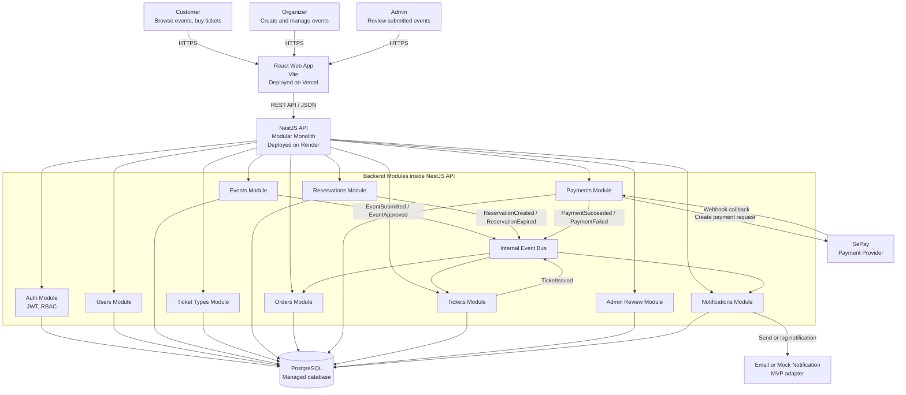
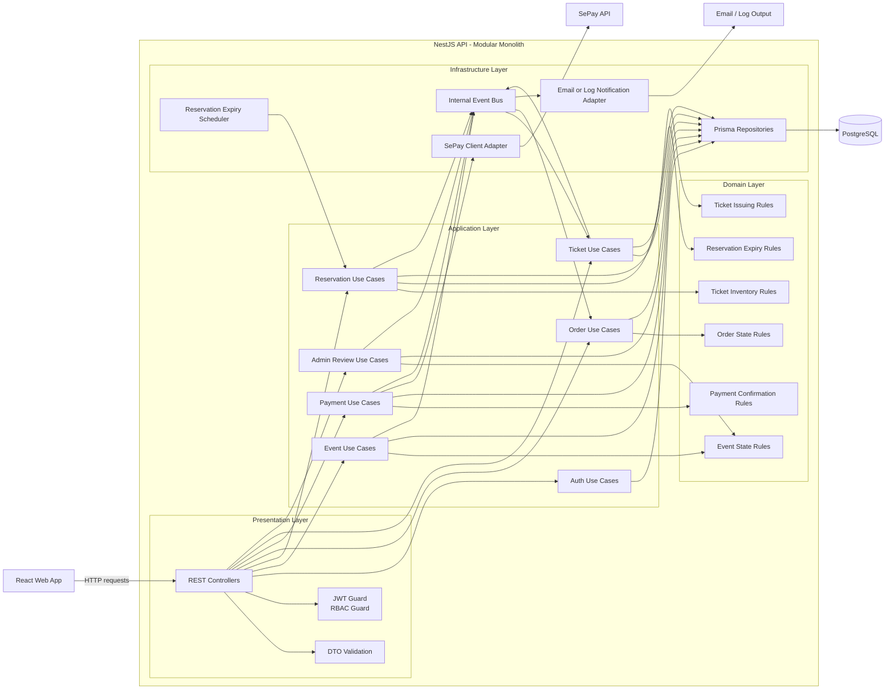
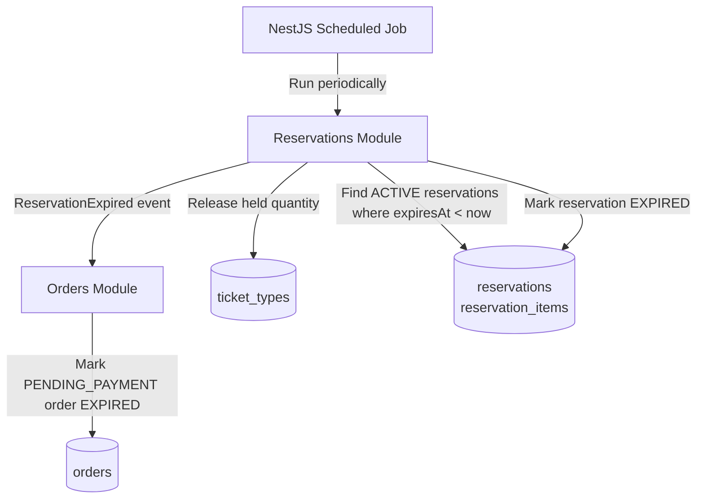
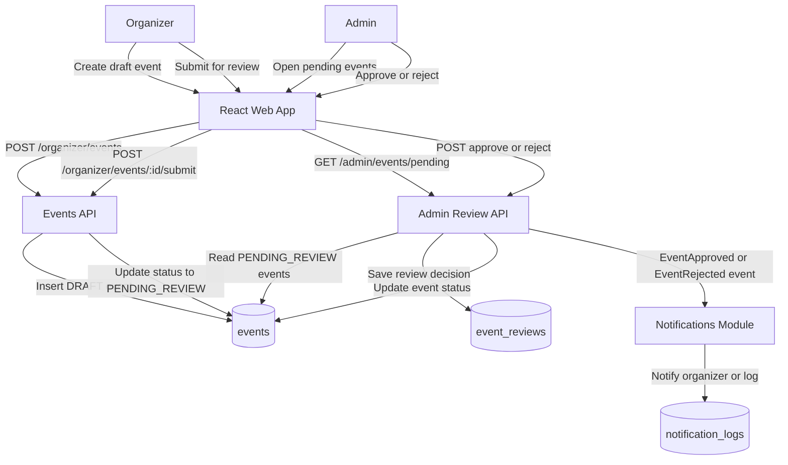
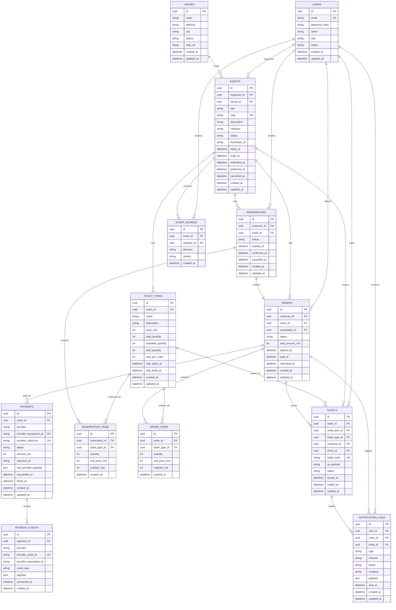

# izTicket Architecture Diagrams

Last updated: 2026-05-23

## How to import into draw.io

Use diagrams.net / draw.io:

1. Open draw.io.
2. Choose `Insert` -> `Advanced` -> `Mermaid`.
3. Copy one Mermaid block from this file.
4. Paste it into the Mermaid dialog.
5. Click `Insert`.

Each section below has a complete Mermaid diagram that can be imported separately.

## 1. Architecture Diagram

Purpose: shows the high-level system architecture, deployment targets, external payment provider, and main backend modules.

## 2. Component Diagram

Purpose: shows the internal backend component structure using layered architecture inside each module.

## 3. Data Flow Diagram

Purpose: shows the main data flow for customer ticket purchase, reservation hold, SePay payment, webhook confirmation, and ticket issuing.

```mermaid
flowchart TD
    Customer["Customer"]
    Web["React Web App"]
    EventsAPI["Events API"]
    ReservationAPI["Reservations API"]
    OrdersAPI["Orders API"]
    PaymentAPI["Payments API"]
    TicketAPI["Tickets API"]
    NotificationModule["Notifications Module"]

    EventsStore[("events<br/>ticket_types")]
    ReservationStore[("reservations<br/>reservation_items")]
    OrderStore[("orders<br/>order_items")]
    PaymentStore[("payments<br/>payment_events")]
    TicketStore[("tickets")]
    SePay["SePay"]
    NotificationLog[("notification_logs")]

    Customer -->|"1. Browse events"| Web
    Web -->|"2. GET /events"| EventsAPI
    EventsAPI -->|"Read published events"| EventsStore
    EventsStore -->|"Event and ticket data"| EventsAPI
    EventsAPI -->|"Event list/detail"| Web

    Customer -->|"3. Select ticket quantity"| Web
    Web -->|"4. POST /reservations"| ReservationAPI
    ReservationAPI -->|"Check event status and sale window"| EventsStore
    ReservationAPI -->|"Conditional decrement available quantity"| EventsStore
    ReservationAPI -->|"Create ACTIVE reservation"| ReservationStore
    ReservationAPI -->|"Reservation id and expiresAt"| Web

    Web -->|"5. POST /orders"| OrdersAPI
    OrdersAPI -->|"Read reservation items"| ReservationStore
    OrdersAPI -->|"Create PENDING_PAYMENT order"| OrderStore
    OrdersAPI -->|"Order id and total amount"| Web

    Web -->|"6. POST /payments/sepay/create"| PaymentAPI
    PaymentAPI -->|"Read order total and status"| OrderStore
    PaymentAPI -->|"Create INITIATED payment"| PaymentStore
    PaymentAPI -->|"Create payment request"| SePay
    SePay -->|"Payment URL or QR data"| PaymentAPI
    PaymentAPI -->|"Payment instruction"| Web

    Customer -->|"7. Complete payment"| SePay
    SePay -->|"8. POST /payments/sepay/webhook"| PaymentAPI
    PaymentAPI -->|"Store raw webhook and check idempotency"| PaymentStore
    PaymentAPI -->|"Mark payment SUCCEEDED"| PaymentStore
    PaymentAPI -->|"Mark order PAID"| OrderStore
    PaymentAPI -->|"Mark reservation CONFIRMED"| ReservationStore
    PaymentAPI -->|"Increment sold quantity"| EventsStore

    PaymentAPI -->|"9. PaymentSucceeded event"| TicketAPI
    TicketAPI -->|"Create issued tickets"| TicketStore
    TicketAPI -->|"10. TicketIssued event"| NotificationModule
    NotificationModule -->|"Log or send ticket notification"| NotificationLog

    Web -->|"11. GET /tickets/my"| TicketAPI
    TicketAPI -->|"Read customer tickets"| TicketStore
    TicketAPI -->|"Issued tickets and QR payload"| Web
    Web -->|"Show e-ticket"| Customer
```

## 4. Reservation Expiry Data Flow

Purpose: shows how unpaid reservations are released after the checkout window expires.

## 5. Admin Approval Data Flow

Purpose: shows how organizer-created events become publicly visible only after admin approval.

## 6. Entity Relationship Diagram

Purpose: shows the main database tables and relationships for the izTicket MVP.

