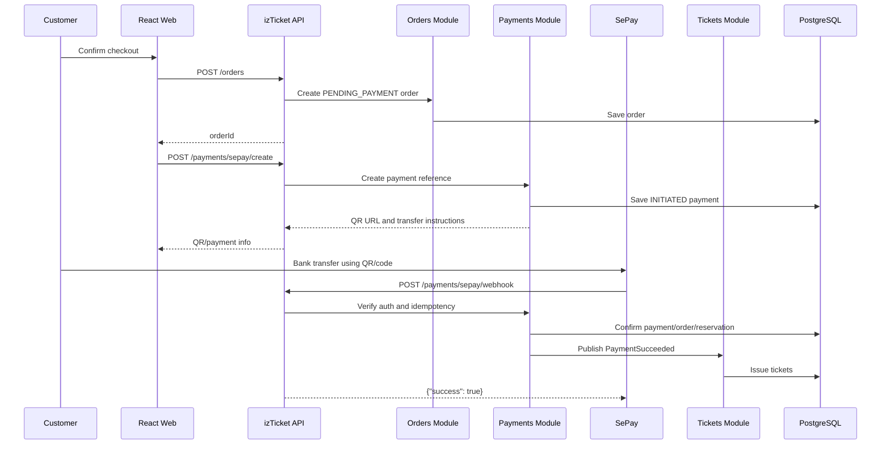

# SePay Integration Guide for izTicket

Last updated: 2026-05-23

## 1. Purpose

This document explains how to integrate SePay into the `izTicket` MVP.

The selected approach is:

> Customer pays by bank transfer / VietQR. SePay detects the incoming bank transaction and sends a webhook to the izTicket backend. The backend verifies the webhook, matches it to an order by payment code, confirms payment, and issues tickets.

This is different from card-based payment gateways such as Stripe. In the basic SePay webhook flow, izTicket creates a payment reference and QR/payment instruction; the customer transfers money; SePay notifies izTicket when the linked bank account receives the transaction.

Official SePay references used:

- [SePay Webhooks overview](https://developer.sepay.vn/vi/sepay-webhooks)
- [Webhook integration guide](https://developer.sepay.vn/vi/sepay-webhooks/tich-hop-webhook)
- [Payment code configuration](https://developer.sepay.vn/vi/sepay-webhooks/cau-hinh-ma-thanh-toan)
- [Webhook authentication](https://developer.sepay.vn/vi/sepay-webhooks/xac-thuc)
- [Webhook security](https://developer.sepay.vn/en/sepay-webhooks/bao-mat)
- [Create payment QR page](https://developer.sepay.vn/vi/sepay-webhooks/tao-qr-va-form-thanh-toan)
- [SePay Test mode](https://developer.sepay.vn/vi/sepay-webhooks/test-mode/bat-dau-nhanh)
- [SePay API v2 overview](https://developer.sepay.vn/vi/sepay-api/v2/gioi-thieu)
- [Transaction reconciliation](https://developer.sepay.vn/vi/sepay-webhooks/doi-soat-giao-dich)

## 2. Fit With izTicket Architecture

SePay belongs to the `Payments Module`.

Related modules:

- `Orders Module`: owns order state.
- `Reservations Module`: owns reservation hold state.
- `TicketTypes Module`: owns inventory counters.
- `Tickets Module`: issues tickets after payment success.
- `Notifications Module`: sends or logs ticket notifications.

The integration should preserve the agreed architecture:

- REST endpoint for frontend: `POST /payments/sepay/create`
- Public webhook endpoint for SePay: `POST /payments/sepay/webhook`
- Strong consistency for payment/order/reservation state changes.
- Idempotency for webhook retries and manual replays.
- Internal event `PaymentSucceeded` after successful confirmation.

## 3. Important SePay Concepts

### 3.1 Linked bank account

SePay sends webhooks when a linked bank account receives or sends a transaction. For izTicket, the important event is inbound transfer, represented in payload as:

```text
transferType = "in"
```

### 3.2 Payment code

SePay can extract a payment code from the bank transfer content. For izTicket, this is the safest way to match a bank transfer to an order.

Recommended code format:

```text
IZT + short payment/order code
```

Examples:

```text
IZT8F3K2Q
IZT202605230001
```

SePay payment-code configuration supports prefixes. Configure:

- Prefix: `IZT`
- Suffix type: alphanumeric if supported by your desired code format
- Suffix length: choose a fixed range, for example 6-12 characters

In the webhook configuration, enable:

- Only send when payment code exists.
- Filter by payment-code prefix `IZT`.

This keeps izTicket from receiving unrelated bank transactions.

### 3.3 QR payment URL

SePay provides a QR image endpoint that can be used to display a VietQR-style payment image.

The general shape is:

```text
https://qr.sepay.vn/img?acc=<ACCOUNT_NUMBER>&bank=<BANK_CODE_OR_NAME>&amount=<AMOUNT_VND>&des=<PAYMENT_CODE>
```

For izTicket:

```text
des = providerReference = payment code, for example IZT8F3K2Q
amount = order.totalAmountVnd
```

The frontend checkout page should show:

- QR image.
- Bank name.
- Account number.
- Transfer amount.
- Transfer content/payment code.
- Countdown until reservation expiry.

### 3.4 Webhook retries

SePay retries failed webhook deliveries. It can also replay webhooks manually from the dashboard. Therefore the webhook handler must be idempotent.

The SePay transaction `id` is stable across retries/replays and should be used as a unique idempotency key.

## 4. End-to-End Payment Flow



## 5. API Contract in izTicket

### 5.1 `POST /payments/sepay/create`

Called by frontend after an order has been created.

Auth:

- Customer only.
- Customer must own the order.

Request:

```json
{
    "orderId": "order_uuid"
}
```

Response:

```json
{
    "paymentId": "payment_uuid",
    "orderId": "order_uuid",
    "status": "INITIATED",
    "provider": "SEPAY",
    "amountVnd": 300000,
    "providerReference": "IZT8F3K2Q",
    "qrImageUrl": "https://qr.sepay.vn/img?acc=0010000000355&bank=Vietcombank&amount=300000&des=IZT8F3K2Q",
    "bankName": "Vietcombank",
    "accountNumber": "0010000000355",
    "transferContent": "IZT8F3K2Q",
    "expiresAt": "2026-05-23T10:15:00.000Z"
}
```

Backend behavior:

1. Load order.
2. Verify order belongs to current customer.
3. Verify order status is `PENDING_PAYMENT`.
4. Verify linked reservation is still `ACTIVE`.
5. Generate unique `providerReference`.
6. Save payment with status `INITIATED`.
7. Return QR URL and transfer instruction.

### 5.2 `POST /payments/sepay/webhook`

Called by SePay.

Auth:

- Public route, but protected by webhook authentication.
- Recommended: HMAC-SHA256.
- Minimum acceptable for local MVP testing: API Key.
- Do not use unauthenticated webhook in production.

Expected success response:

```json
{
    "success": true
}
```

Important: SePay expects HTTP `200` or `201`, JSON body exactly indicating `success: true`, and a timely response.

## 6. SePay Webhook Payload

Typical payload fields:

```json
{
    "id": 92704,
    "gateway": "Vietcombank",
    "transactionDate": "2024-07-02 11:08:33",
    "accountNumber": "1017588888",
    "subAccount": "",
    "code": "IZT8F3K2Q",
    "content": "IZT8F3K2Q chuyen tien",
    "transferType": "in",
    "description": "NGUYEN VAN A chuyen tien",
    "transferAmount": 300000,
    "accumulated": 105000000,
    "referenceCode": "FT24012345678"
}
```

Field mapping for izTicket:

| SePay field       | izTicket mapping                        | Notes                                             |
| ----------------- | --------------------------------------- | ------------------------------------------------- |
| `id`              | `payment_events.providerEventId`        | Use as unique idempotency key.                    |
| `gateway`         | payload only or audit field             | Bank name.                                        |
| `transactionDate` | payload only or parsed audit timestamp  | Vietnam local time string.                        |
| `accountNumber`   | validation against env                  | Must match configured receiving account.          |
| `subAccount`      | payload only                            | VA if used.                                       |
| `code`            | `payments.providerReference`            | Main order matching key.                          |
| `content`         | payload only                            | Original bank transfer content.                   |
| `transferType`    | validation                              | Must be `in` for customer payment.                |
| `description`     | payload only                            | Bank description.                                 |
| `transferAmount`  | validation against `payments.amountVnd` | Must equal expected amount.                       |
| `accumulated`     | payload only                            | Do not rely on it for order matching.             |
| `referenceCode`   | `payments.providerTransactionId`        | Bank reference; may be useful for reconciliation. |

## 7. Environment Variables

Recommended backend environment variables:

```text
SEPAY_MODE=test
SEPAY_BANK_NAME=Vietcombank
SEPAY_BANK_CODE=Vietcombank
SEPAY_BANK_ACCOUNT_NUMBER=0010000000355
SEPAY_PAYMENT_CODE_PREFIX=IZT
SEPAY_QR_BASE_URL=https://qr.sepay.vn/img

SEPAY_WEBHOOK_AUTH_MODE=hmac
SEPAY_WEBHOOK_SECRET=<hmac-secret>
SEPAY_WEBHOOK_API_KEY=<api-key-if-used>

SEPAY_API_TOKEN=<optional-api-token-for-reconciliation>
SEPAY_USER_API_BASE_URL=https://userapi-sandbox.sepay.vn/v2
```

Production values:

```text
SEPAY_MODE=live
SEPAY_USER_API_BASE_URL=https://userapi.sepay.vn/v2
```

Never commit actual SePay secrets.

## 8. Payment Reference Design

The payment reference must be:

- Unique.
- Short enough for bank transfer content.
- Compatible with SePay payment-code extraction.
- Easy to search in logs.

Recommended format:

```text
IZT + 8-12 uppercase alphanumeric chars
```

Example:

```text
IZT9K3F7Q2A
```

Database fields:

- `payments.provider = "SEPAY"`
- `payments.providerReference = "IZT9K3F7Q2A"`
- `payments.status = "INITIATED"`
- `payments.amountVnd = order.totalAmountVnd`

Suggested unique constraint:

```text
unique(provider, providerReference)
```

## 9. QR Generation

Backend helper:

```ts
type SepayQrInput = {
    accountNumber: string;
    bankCode: string;
    amountVnd: number;
    description: string;
};

export function buildSepayQrImageUrl(input: SepayQrInput): string {
    const params = new URLSearchParams({
        acc: input.accountNumber,
        bank: input.bankCode,
        amount: String(input.amountVnd),
        des: input.description,
    });

    return `https://qr.sepay.vn/img?${params.toString()}`;
}
```

Frontend checkout behavior:

- Display QR image from `qrImageUrl`.
- Display transfer content as copyable text.
- Display amount as copyable text.
- Poll order/payment status every 3 seconds.
- Stop polling when order becomes `PAID`, `EXPIRED`, `CANCELLED`, or `PAYMENT_REVIEW`.
- Show countdown based on `expiresAt`.

## 10. Webhook Authentication

### 10.1 Recommended: HMAC-SHA256

SePay recommends HMAC-SHA256 for stronger webhook authentication.

Expected behavior:

1. Read raw request body.
2. Read SePay timestamp header.
3. Read SePay signature header.
4. Reject if timestamp is too old.
5. Recreate signature using:

```text
sha256 = HMAC_SHA256(secret, timestamp + "." + rawBody)
```

6. Compare signatures using constant-time comparison.

Important NestJS note:

- HMAC verification must use the raw request body.
- Do not verify against `JSON.stringify(req.body)` because serialization can change whitespace/order.

Recommended NestJS setup:

```ts
// apps/api/src/main.ts
const app = await NestFactory.create(AppModule, {
    rawBody: true,
});
```

Verifier outline:

```ts
import { createHmac, timingSafeEqual } from 'node:crypto';

type VerifySepayHmacInput = {
    rawBody: Buffer;
    timestamp: string | undefined;
    signature: string | undefined;
    secret: string;
    toleranceSeconds: number;
};

export function verifySepayHmac(input: VerifySepayHmacInput): boolean {
    if (!input.timestamp || !input.signature) {
        return false;
    }

    const timestampMs = Number(input.timestamp) * 1000;
    if (!Number.isFinite(timestampMs)) {
        return false;
    }

    const ageSeconds = Math.abs(Date.now() - timestampMs) / 1000;
    if (ageSeconds > input.toleranceSeconds) {
        return false;
    }

    const expected = `sha256=${createHmac('sha256', input.secret)
        .update(`${input.timestamp}.${input.rawBody.toString('utf8')}`)
        .digest('hex')}`;

    const expectedBuffer = Buffer.from(expected);
    const actualBuffer = Buffer.from(input.signature);

    return (
        expectedBuffer.length === actualBuffer.length &&
        timingSafeEqual(expectedBuffer, actualBuffer)
    );
}
```

Header names must be confirmed during implementation against the SePay dashboard/test request. The official docs describe the HMAC formula; verify the exact header casing/name in test delivery logs.

### 10.2 Simpler option: API Key

SePay can send:

```text
Authorization: Apikey YOUR_API_KEY
```

This is easier for local MVP testing but less strong than HMAC because it does not prove the payload was not modified.

## 11. Webhook Processing Algorithm

Endpoint:

```text
POST /api/v1/payments/sepay/webhook
```

Algorithm:

1. Verify webhook authentication.
2. Parse payload.
3. Validate required fields:
    - `id`
    - `transferType`
    - `transferAmount`
    - `accountNumber`
    - `code`
4. Reject or ignore non-inbound transactions:
    - `transferType !== "in"`
5. Validate receiving account:
    - `payload.accountNumber === SEPAY_BANK_ACCOUNT_NUMBER`
6. Insert `payment_events` with unique key:
    - `provider = "SEPAY"`
    - `providerEventId = String(payload.id)`
    - `providerTransactionId = payload.referenceCode`
    - `payload = raw payload`
7. If insert hits unique constraint:
    - return `{"success": true}`
    - do not repeat business side effects
8. Find payment:
    - `provider = "SEPAY"`
    - `providerReference = payload.code`
    - `status = "INITIATED"` or already final
9. Validate amount:
    - `payload.transferAmount === payment.amountVnd`
10. Load order and reservation.
11. If reservation is `ACTIVE` and not expired:

- mark payment `SUCCEEDED`
- mark order `PAID`
- mark reservation `CONFIRMED`
- increment `ticket_types.soldQuantity`
- emit `PaymentSucceeded`

12. If reservation is expired/cancelled:

- mark payment `SUCCEEDED`
- mark order `PAYMENT_REVIEW`
- do not issue tickets automatically

13. Return `{"success": true}`.

## 12. Transaction Boundary

The core webhook confirmation should happen in a database transaction:

```text
BEGIN
  insert payment_event unique by SePay id
  find payment by providerReference
  validate amount/account/type
  update payment status
  update order status
  update reservation status
  update ticket_type sold counters
COMMIT
emit PaymentSucceeded after commit
```

Why emit after commit:

- Ticket issuing should only happen after payment/order/reservation states are durable.
- If ticket issuing fails, the system can retry from a known paid order state.

## 13. Matching and Failure Rules

| Condition                          | Action                                                                                       |
| ---------------------------------- | -------------------------------------------------------------------------------------------- |
| Duplicate SePay `id`               | Return success, no side effects.                                                             |
| `transferType !== "in"`            | Store audit if desired, return success or ignore.                                            |
| `accountNumber` mismatch           | Store event as suspicious, return success only if you do not want retries; otherwise reject. |
| `code` missing                     | Cannot match order. Store event, return success, review manually.                            |
| `code` not found in payments       | Store event, return success, review manually.                                                |
| Amount lower than expected         | Mark payment/order `REQUIRES_REVIEW` or keep pending; do not issue tickets.                  |
| Amount higher than expected        | Mark `REQUIRES_REVIEW`; do not auto-issue unless business rule explicitly allows.            |
| Order already `PAID`               | Return success. Do not issue tickets again.                                                  |
| Reservation expired before webhook | Mark order `PAYMENT_REVIEW`; do not issue tickets automatically.                             |

For the course MVP, the safest rule is exact amount matching.

## 14. Database Mapping

Existing planned tables are enough:

- `payments`
- `payment_events`
- `orders`
- `reservations`
- `tickets`

Recommended field usage:

### `payments`

| Field                   | Value                                                 |
| ----------------------- | ----------------------------------------------------- |
| `provider`              | `SEPAY`                                               |
| `providerReference`     | izTicket-generated payment code, e.g. `IZT9K3F7Q2A`   |
| `providerTransactionId` | SePay `referenceCode` after webhook                   |
| `status`                | `INITIATED`, `SUCCEEDED`, `FAILED`, `REQUIRES_REVIEW` |
| `amountVnd`             | Expected order amount                                 |
| `paymentUrl`            | QR image URL or null if generated dynamically         |
| `rawProviderPayload`    | Last webhook payload snapshot                         |

### `payment_events`

| Field                   | Value                                        |
| ----------------------- | -------------------------------------------- |
| `provider`              | `SEPAY`                                      |
| `providerEventId`       | `String(payload.id)`                         |
| `providerTransactionId` | `payload.referenceCode`                      |
| `eventType`             | `bank.transfer.in` or similar internal label |
| `payload`               | Full webhook payload                         |
| `processedAt`           | Set after processing is complete             |

## 15. NestJS Module Structure

Recommended structure:

```text
apps/api/src/modules/payments/
  payments.module.ts
  payments.controller.ts
  payments.service.ts
  dto/
    create-sepay-payment.dto.ts
    sepay-webhook.dto.ts
  sepay/
    sepay-config.ts
    sepay-payment-reference.service.ts
    sepay-qr.service.ts
    sepay-webhook-verifier.service.ts
    sepay-webhook.mapper.ts
  tests/
    sepay-webhook-verifier.spec.ts
    sepay-webhook-processing.spec.ts
```

Suggested service responsibilities:

| Service                        | Responsibility                                            |
| ------------------------------ | --------------------------------------------------------- |
| `PaymentsService`              | Create payments, confirm payments, expose payment status. |
| `SepayPaymentReferenceService` | Generate unique payment code.                             |
| `SepayQrService`               | Build QR image URL and transfer instructions.             |
| `SepayWebhookVerifierService`  | Verify HMAC/API key.                                      |
| `SepayWebhookMapper`           | Normalize SePay payload to internal command.              |

## 16. Controller Sketch

```ts
@Controller('payments/sepay')
export class SepayPaymentsController {
    constructor(private readonly paymentsService: PaymentsService) {}

    @Post('create')
    @Roles(UserRole.CUSTOMER)
    createPayment(
        @CurrentUser() user: AuthenticatedUser,
        @Body() dto: CreateSepayPaymentDto,
    ) {
        return this.paymentsService.createSepayPayment(user.id, dto.orderId);
    }

    @Post('webhook')
    async handleWebhook(@Req() request: RawBodyRequest<Request>) {
        await this.paymentsService.handleSepayWebhook({
            headers: request.headers,
            rawBody: request.rawBody,
            body: request.body,
        });

        return { success: true };
    }
}
```

Adjust exact types based on the NestJS/Express setup in the repo.

## 17. Test Mode Setup

Use SePay Test mode before live testing:

1. Log in to SePay dashboard.
2. Enable Test mode.
3. Create a test bank account.
4. Create a test webhook pointing to:

```text
https://<your-ngrok-domain>/api/v1/payments/sepay/webhook
```

5. Configure payment-code recognition with prefix `IZT`.
6. Create an izTicket order/payment locally.
7. Simulate an inbound transaction in SePay Test mode:

```text
Amount: exact order total
Content: IZTxxxxxx thanh toan ve
Transfer type: in
```

8. Confirm:

- `payment_events` has one new row.
- `payments.status` becomes `SUCCEEDED`.
- `orders.status` becomes `PAID`.
- `reservations.status` becomes `CONFIRMED`.
- `tickets` are issued.
- Webhook response body is `{ "success": true }`.

## 18. Local Development With ngrok

SePay must reach your local backend through a public URL.

Example:

```text
ngrok http 3000
```

Webhook URL:

```text
https://<ngrok-domain>/api/v1/payments/sepay/webhook
```

When ngrok URL changes, update the webhook URL in SePay Test mode.

## 19. Reconciliation Strategy

Webhook is real-time, but reconciliation is useful when:

- Your server was down.
- Webhook retries failed.
- A payment is stuck in `PENDING_PAYMENT`.
- A transaction arrived without a recognized code.

SePay API v2 can list transactions, with different base URLs:

```text
Production: https://userapi.sepay.vn/v2
Sandbox:    https://userapi-sandbox.sepay.vn/v2
```

The relevant endpoint for reconciliation:

```text
GET /transactions
```

Suggested MVP reconciliation job:

1. Every 5-15 minutes, fetch recent transactions.
2. Filter inbound transactions with code prefix `IZT`.
3. For each unseen SePay transaction id, run the same matching logic as webhook.
4. Store results in `payment_events`.

This is optional for the course MVP but valuable for the report's reliability section.

## 20. Security Checklist

For local/test:

- Use Test mode.
- Use ngrok or a public test URL.
- Use API Key at minimum.
- Store raw payloads for debugging.

For deployed demo:

- Use HTTPS endpoint.
- Prefer HMAC-SHA256 authentication.
- Store secret only in Render env vars.
- Validate account number.
- Validate amount.
- Validate transfer type.
- Deduplicate by SePay transaction `id`.
- Return success quickly.
- Log suspicious/unmatched transactions.

For production-grade future work:

- Add SePay IP allowlist.
- Add replay protection based on timestamp.
- Add reconciliation job.
- Add admin screen for `PAYMENT_REVIEW`.
- Add refund/manual resolution flow.

## 21. Testing Checklist

### Unit tests

- Generate payment reference with correct prefix.
- QR URL contains `acc`, `bank`, `amount`, and `des`.
- HMAC verifier accepts valid signature.
- HMAC verifier rejects invalid signature.
- API Key verifier accepts expected key.
- Missing `code` does not confirm order.
- Amount mismatch does not issue tickets.
- Duplicate SePay `id` does not process twice.

### E2E tests

- Customer creates payment and receives QR info.
- Simulated SePay success webhook confirms order.
- Duplicate webhook returns success and does not duplicate tickets.
- Webhook for expired reservation moves order to `PAYMENT_REVIEW`.
- Webhook with wrong amount does not issue tickets.
- Webhook with wrong account number does not issue tickets.

### Manual test in SePay Test mode

- Simulate transaction with correct amount/code.
- Simulate transaction with wrong code.
- Simulate transaction with wrong amount.
- Use dashboard replay to confirm idempotency.

## 22. Demo Script

For the final course demo:

1. Customer reserves tickets.
2. Customer opens checkout page.
3. Frontend shows QR and transfer content `IZT...`.
4. In SePay Test mode, simulate inbound transfer with exact amount and content.
5. Show webhook response success in logs.
6. Show order status becomes `PAID`.
7. Show customer ticket page with issued ticket.
8. Replay the same webhook and show no duplicate ticket is issued.

## 23. Implementation Cut Line

Must have:

- QR/payment instruction generation.
- Payment code matching.
- Webhook endpoint.
- Webhook authentication, at least API Key for test and HMAC planned/implemented if possible.
- Idempotency by SePay `id`.
- Exact amount validation.
- Confirm payment/order/reservation.
- Issue tickets after successful payment.

Can simplify:

- Real email notification.
- Reconciliation job.
- Admin payment review UI.
- IP allowlist.
- OAuth 2.0 webhook authentication.

Do not skip:

- Idempotency.
- Amount validation.
- Reservation expiry handling.
- Manual handling path for late payment.
