# izTicket System Flows

Last updated: 2026-05-23

## 1. Overview

This document describes the main runtime flows for the `izTicket` MVP:

- Organizer creates and submits an event.
- Admin approves or rejects the event.
- Customer browses a public event and reserves tickets.
- Customer creates an order and pays through SePay.
- Payment webhook confirms the order.
- System issues e-tickets.
- Reservation expiry releases unpaid tickets.

The most important architectural concern is correctness around ticket inventory and payment confirmation.

## 2. Event Creation and Approval Flow

### Purpose

Organizer-created events should not appear publicly until an admin reviews and approves them.

### Flow

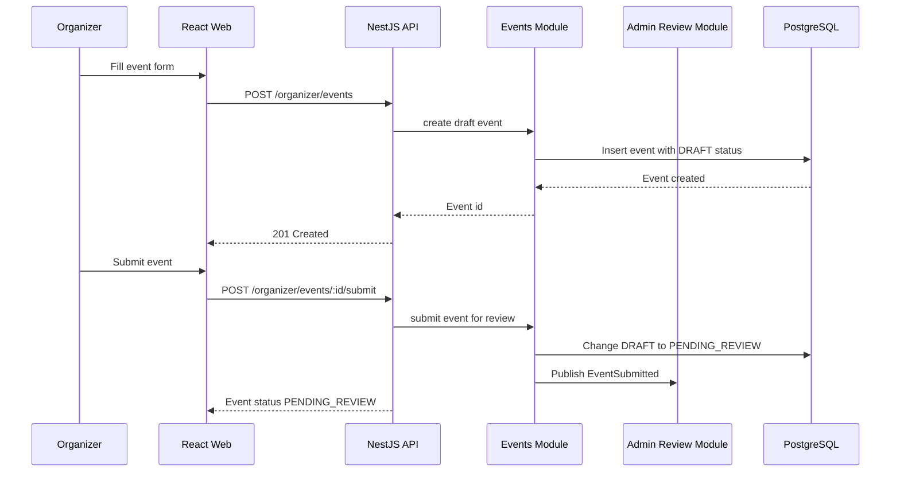

### Admin approval

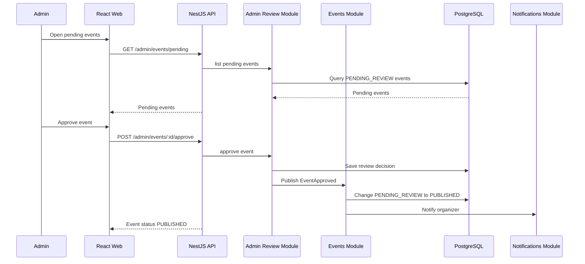

### Business rules

- Only organizers can create events.
- Organizers can only edit their own events.
- Public users can only see `PUBLISHED` events.
- Admin can approve or reject only `PENDING_REVIEW` events.
- Rejected events can be edited and submitted again.

## 3. Customer Checkout Flow

### Purpose

The system must prevent overselling while giving customers a short payment window.

### High-level flow

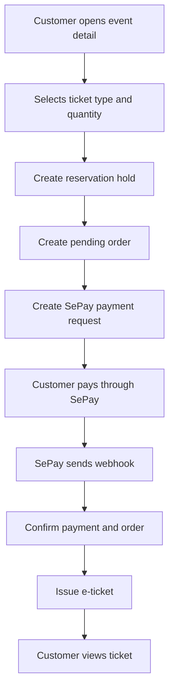

## 4. Reservation Creation Flow

### Purpose

Reservation holds ticket inventory for 10-15 minutes while the customer completes payment.

### Flow

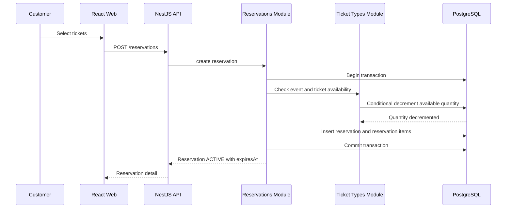

### Critical transaction behavior

The reservation operation should be atomic:

1. Validate event is `PUBLISHED`.
2. Validate ticket sale window.
3. Validate requested quantity.
4. Decrement available quantity only if enough quantity is still available.
5. Create reservation with `ACTIVE` status and `expiresAt`.
6. Create reservation items.
7. Commit transaction.

If any step fails, the transaction rolls back and no tickets are held.

### Oversell prevention

The database update should be conditional:

```text
UPDATE ticket_types
SET available_quantity = available_quantity - requested_quantity
WHERE id = ticket_type_id
  AND available_quantity >= requested_quantity
```

If no row is updated, the system returns an insufficient quantity error.

## 5. Order and Payment Creation Flow

### Purpose

The order records the checkout amount and links the reservation to a payment request.

### Flow

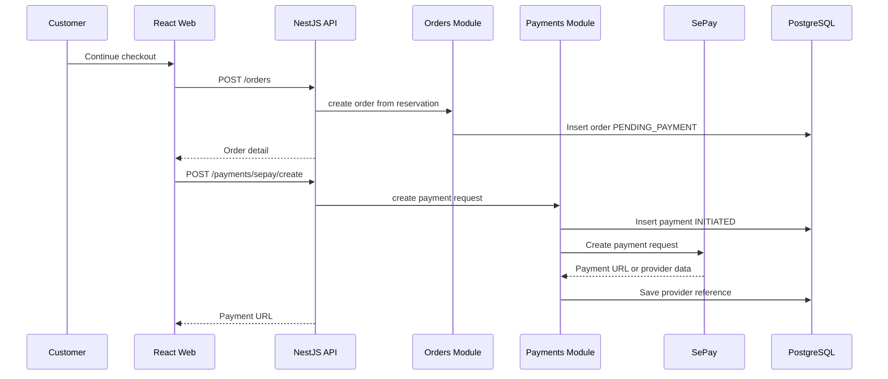

### Business rules

- Order can only be created from an `ACTIVE` reservation.
- Order total must be calculated server-side from reservation items.
- Customer cannot change ticket quantity after reservation is created.
- Payment can only be created for `PENDING_PAYMENT` orders.

## 6. Payment Webhook Success Flow

### Purpose

SePay webhook is the source of truth for payment confirmation.

### Flow

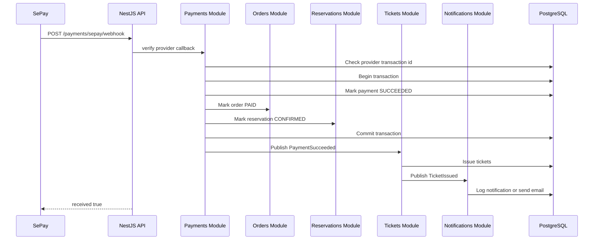

### Idempotency rules

Webhook processing must be idempotent because providers may retry callbacks.

The system should:

- Store provider transaction id or unique reference.
- Check whether the provider event has already been processed.
- Return success for duplicate already-processed success callbacks.
- Avoid issuing tickets twice.
- Avoid incrementing or decrementing inventory twice.

## 7. Reservation Expiry Flow

### Purpose

If a customer does not pay before `expiresAt`, held tickets must be released.

### Flow

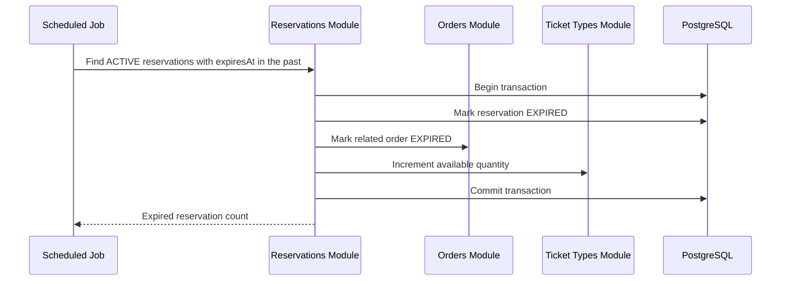

### Business rules

- Expiry should only affect `ACTIVE` reservations.
- Confirmed reservations must never release inventory.
- Expiry should be safe to run repeatedly.
- For the MVP, a scheduled NestJS task is enough.
- When scaling, this can move to a queue worker.

## 8. Late Payment Edge Case

### Scenario

Payment succeeds after the reservation already expired.

This can happen when:

- Customer pays at the very end of the checkout window.
- SePay webhook is delayed.
- The expiry job runs before payment callback is received.

### Recommended behavior

The system should not automatically issue tickets if the reservation is already expired.

Instead:

1. Store payment as `SUCCEEDED`.
2. Move order to `PAYMENT_REVIEW`.
3. Do not issue tickets automatically.
4. Admin or support can decide whether to refund or manually issue tickets if inventory is still available.

This is safer than silently overselling.

## 9. Payment Failure Flow

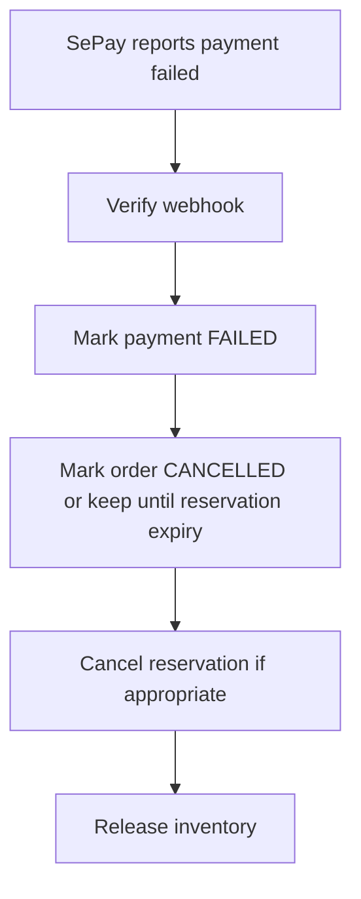

For MVP simplicity, failed payment can cancel the order and reservation immediately. If the provider allows retry, the order may remain `PENDING_PAYMENT` until reservation expiry.

## 10. Ticket Issuing Flow

### Purpose

Tickets should be issued only after confirmed successful payment.

### Flow

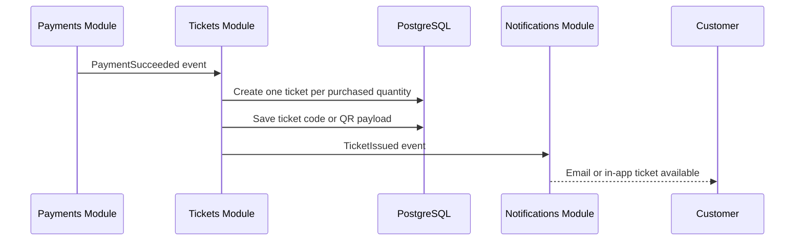

### Business rules

- Tickets are created only for `PAID` orders.
- Ticket issuance must be idempotent.
- Each issued ticket should have a unique code or signed QR payload.
- Customer can view issued tickets in `GET /tickets/my`.

## 11. State Machines

### Event state

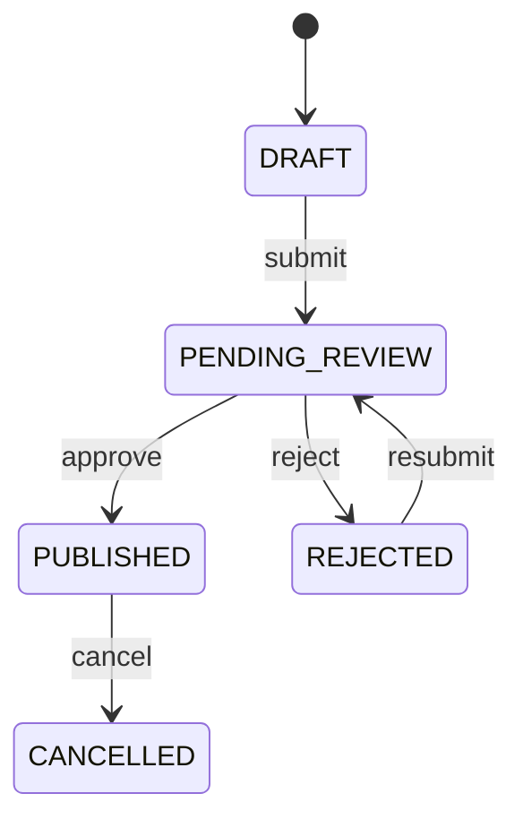

### Reservation state

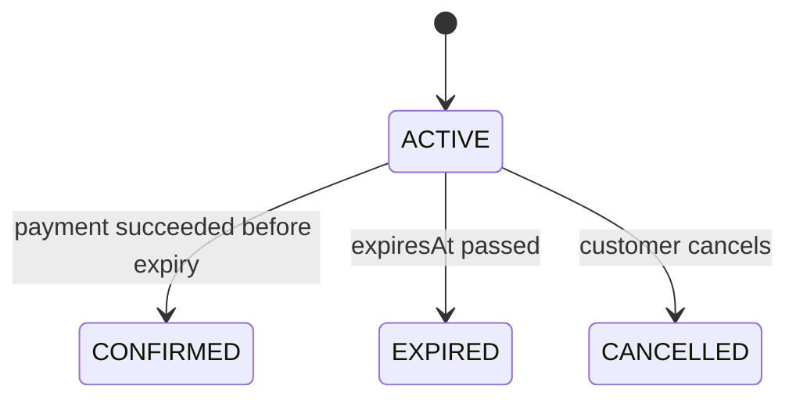

### Order state

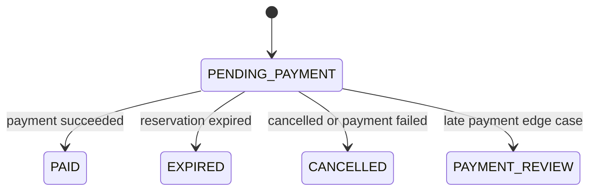

### Payment state

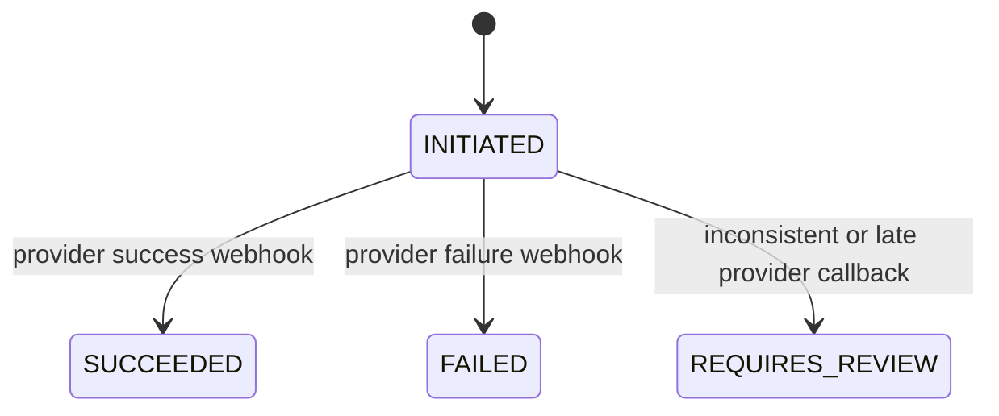

## 12. Frontend Route Flow

### Customer

```text
/events
/events/:eventId
/checkout/:reservationId
/payment-result
/my-tickets
```

Main customer path:

```text
Event list -> Event detail -> Select tickets -> Checkout -> SePay payment -> Payment result -> My tickets
```

### Organizer

```text
/organizer
/organizer/events
/organizer/events/new
/organizer/events/:eventId/edit
/organizer/events/:eventId/orders
```

Main organizer path:

```text
Dashboard -> Create event -> Configure ticket types -> Submit for review -> Track status -> View orders
```

### Admin

```text
/admin
/admin/events/pending
/admin/events/:eventId/review
```

Main admin path:

```text
Pending events -> Review detail -> Approve or reject
```

## 13. Operational Flows

### Deployment

- Frontend is deployed to Vercel.
- Backend is deployed to Render.
- Database is managed PostgreSQL.
- Environment variables are configured separately for frontend and backend.

### Background processing

For MVP:

- Use a scheduled task inside NestJS to expire reservations.
- Use internal events for notifications and ticket issuing.
- Notification can be logged instead of sending real email.

For future scale:

- Move reservation expiry to a worker.
- Add Redis/BullMQ for jobs.
- Use a message broker if modules are split into services.

## 14. Flow-Level Risks and Mitigations

| Risk                                      | Flow affected                   | Mitigation                                                            |
| ----------------------------------------- | ------------------------------- | --------------------------------------------------------------------- |
| Overselling tickets                       | Reservation creation            | Transaction and conditional inventory update.                         |
| Duplicate ticket issuing                  | Payment webhook, ticket issuing | Idempotent payment and ticket creation.                               |
| Late payment after expiry                 | Payment webhook                 | Move order to `PAYMENT_REVIEW`; do not auto-issue tickets.            |
| Public event appears before approval      | Event creation                  | Require `PUBLISHED` status in public listing queries.                 |
| Organizer edits another organizer's event | Organizer dashboard             | Scope all organizer queries by authenticated organizer id.            |
| Webhook spoofing                          | Payment integration             | Verify SePay webhook signature/token/reference during implementation. |
